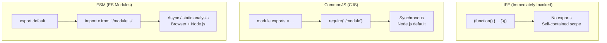

# JavaScript Module Systems: IIFE, ESM, CommonJS

<p align="center">
  
  
  
  
  
</p>

Side-by-side **code examples** comparing the three JavaScript module systems — IIFE, ECMAScript Modules (ESM), and CommonJS (CJS) — plus a Jenkins CI/CD pipeline to automate testing and delivery.

---

## 📖 What This Covers

| Pattern | File | Use case |
|---|---|---|
| **IIFE** | `IIFE.js` | Encapsulate code without a module system (legacy browsers, scripts) |
| **CommonJS** | `CJM.js` | Node.js standard module system (`require` / `module.exports`) |
| **ESM** | `ESM.js` | Modern JavaScript native modules (`import` / `export`) |

---

## 🔍 Key Differences



---

## 🚀 Run the Examples

```bash
git clone https://github.com/ahmadalsharef994/IIFE-ESM-CJM-Examples.git
cd IIFE-ESM-CJM-Examples

node IIFE.js
node CJM.js
node ESM.js      # requires "type": "module" in package.json or .mjs extension
```

---

## ⚙️ Jenkins Pipeline

The included `Jenkinsfile` sets up a CI pipeline with Test and Deliver stages:

```
Pipeline: Install → Test → Deliver
```

```bash
# Stages defined in .jenkins/
├── Jenkinsfile
└── .jenkins/
    ├── test.sh
    └── deliver.sh
```

---

## 📄 License

MIT
